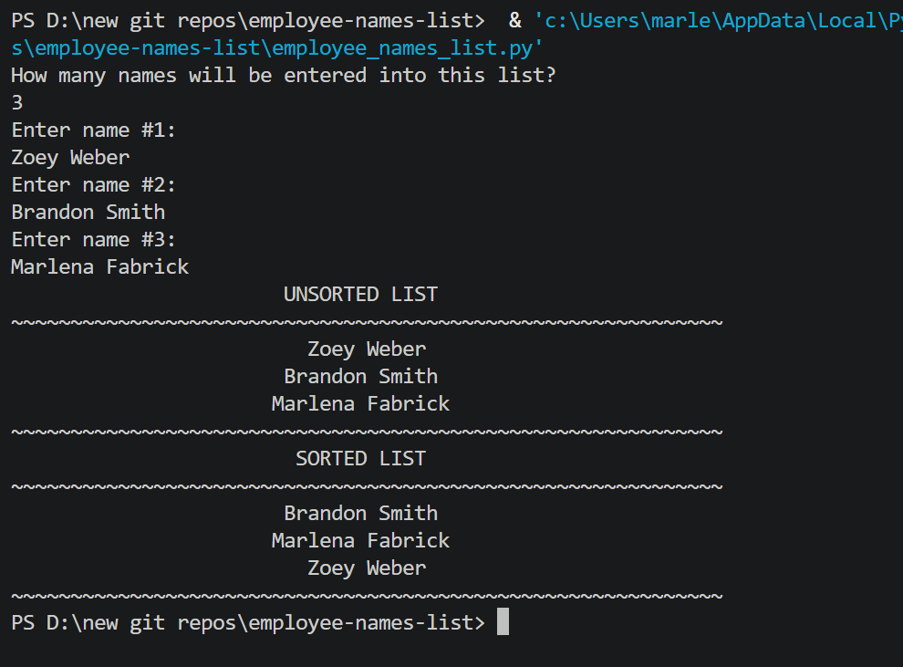

# 👥 Employee Names List

A Python console program that collects employee names into a **list/array**, displays them in unsorted order, then sorts and displays them alphabetically — demonstrating Python list creation, WHILE loop indexing, and the built-in `sort()` method.

---

## Features

- User defines how many names to store
- Names stored in a Python list using a WHILE loop
- Displays names in original (unsorted) order
- Sorts the list alphabetically using `list.sort()`
- Displays names in sorted order
- Input validation — rejects non-numeric and zero/negative values for list size
- Bug fix: original had a syntax error that prevented the sorted list header from displaying

---

## How It Works

1. User enters how many names to store
2. A list is initialized: `name = [""] * size`
3. A WHILE loop populates the list by index position
4. The unsorted list is displayed centered in 60 characters
5. `name.sort()` sorts the list alphabetically
6. The sorted list is displayed

---

## Example Output

```
How many names will be entered into this list?
4
Enter name #1:
Smith, John
Enter name #2:
Adams, Mary
Enter name #3:
Wilson, Tom
Enter name #4:
Brown, Lisa
                    UNSORTED LIST
~~~~~~~~~~~~~~~~~~~~~~~~~~~~~~~~~~~~~~~~~~~~~~~~~~~~~~~~~~~~
                    Smith, John
                    Adams, Mary
                    Wilson, Tom
                    Brown, Lisa
~~~~~~~~~~~~~~~~~~~~~~~~~~~~~~~~~~~~~~~~~~~~~~~~~~~~~~~~~~~~
                     SORTED LIST
~~~~~~~~~~~~~~~~~~~~~~~~~~~~~~~~~~~~~~~~~~~~~~~~~~~~~~~~~~~~
                    Adams, Mary
                    Brown, Lisa
                    Smith, John
                    Wilson, Tom
~~~~~~~~~~~~~~~~~~~~~~~~~~~~~~~~~~~~~~~~~~~~~~~~~~~~~~~~~~~~
```

---

## Screenshot



---

## Bug That Was Fixed

The original code had a syntax error on the sorted list header line:
```python
print("SORTED LIST", "^60"))   # BROKEN — missing format(), extra )
```
Fixed to:
```python
print(format("SORTED LIST", "^60"))   # CORRECT
```
This syntax error would have prevented the program from running at all.

---

## Technologies Used

- Python 3
- Python lists — `[""] * size` to initialize with empty strings
- WHILE loops — for populating and displaying the list by index
- `list.sort()` — built-in alphabetical sorting
- `format()` with `"^60"` — centered text formatting

---

## Learning Outcomes

- Defining and initializing a Python list
- Using a WHILE loop with an index to populate a list
- Built-in `list.sort()` method
- Centered text formatting with `format(value, "^width")`
- Input validation for list size

---

## How to Run

1. Make sure Python 3 is installed: https://www.python.org/downloads/
2. Clone or download this repo
3. Open a terminal in the repo folder
4. Run: `python employee_names_list.py`
5. Follow the prompts

---

## Folder Structure

```
employee-names-list/
├── employee_names_list.py
├── output.png
├── README.md
├── LICENSE
└── .gitignore
```

---

## License

This project is licensed under the MIT License — see the [LICENSE](LICENSE) file for details.

---

*Written by Marlena Fabrick — Computer Programming, Fall 2020*

---
